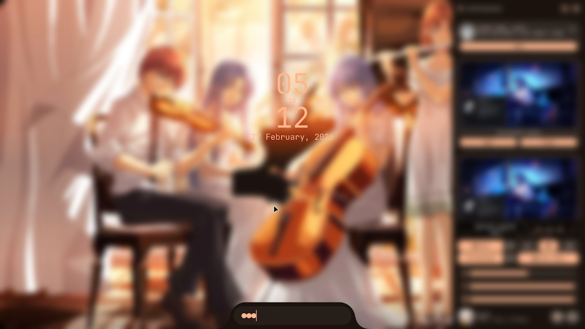

# exs-lock
Session lock for Wayland compositors based on GTK3 and GtkSessionLock.

Lightweight, minimal and configurable.

## Preview
<p align="center">
  
</p>

---

## Dependencies

- Gtk3
- [GtkSessionLock](https://github.com/Cu3PO42/gtk-session-lock)

---

## Installation

### Quick install (recommended)
```bash
curl -fsSl https://raw.githubusercontent.com/kipoha/exs-lock/refs/heads/main/scripts/install.sh | sudo bash
```
### Manual install
```bash
git clone https://github.com/kipoha/exs-lock.git
cd exs-shell
chmod +x scripts/install-local.sh
sudo ./scripts/install.sh
```

### Development install
```bash
git clone https://github.com/kipoha/exs-lock.git
cd exs-shell
chmod +x scripts/install-dev.sh
sudo ./scripts/install-dev.sh
```
---

### Verify installation:
```bash
which exs-lock
```


## Uninstall
```bash
curl -fsSl https://raw.githubusercontent.com/kipoha/exs-shell/refs/heads/main/scripts/unstall.sh | sudo bash
```

---

## Configuration

Config file:
`~/.config/exs-shell/config.jsonc`

Example:

```json
{
  "_lock": {
    "entry_visibility": false,
    "entry_position": "bottom",
    "blur_radius": 10
  }
}
```

---

## Options
###### `entry_visibility`
- Type: boolean
- Default: false
- Controls whether the password entry is visible by default.

###### `entry_position`
- Type: "top" | "center" | "bottom"
- Default: "bottom"
- Controls vertical position of the password entry container.

###### `blur_radius`
- Type: integer
- Range: 0 - 100
- Default: 10
- Background blur intensity.
- Values outside valid range will fallback to default.

> **Note:** When used with [Exs-Shell](https://github.com/kipoha/exs-shell.git),  
> `exs-lock` can be configured via Exs-Shell's built-in settings.  
> After installing `exs-lock`, restart or reload Exs-Shell to enable lock support.

---

[Discord](https://discord.com/invite/FbdqgpnY9P)

---

## Related Projects

- [exs-shell](https://github.com/kipoha/exs-shell) – Desktop shell for Niri Wayland Compositor
